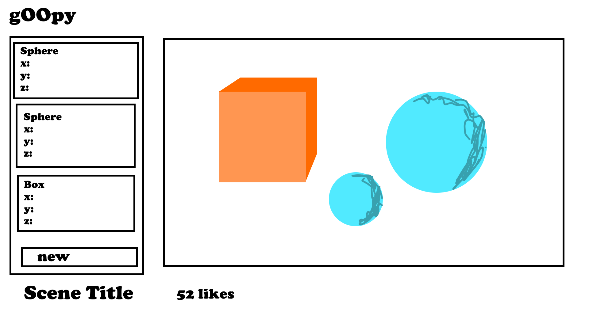
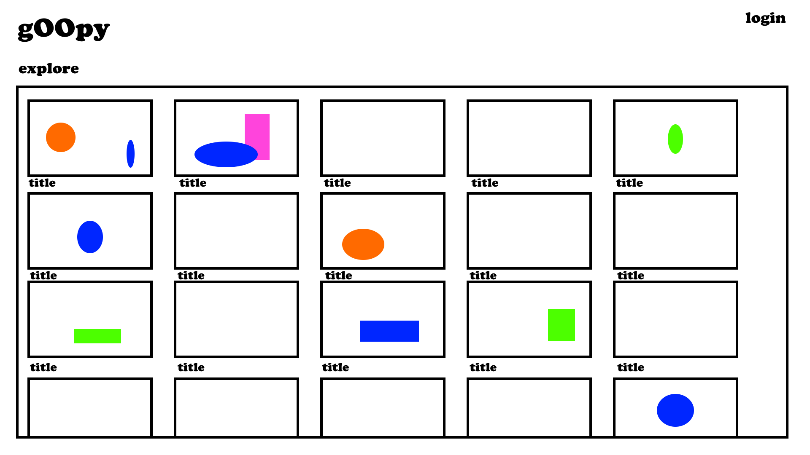

# Group 08 - gOOpy

## Describe your topic/interest in about 150-200 words

gOOpy is a 3D modeling software using ray marching rendering method, and signed distance functions (SDFs) to define geometry. Our goal is to enable artists to create 3D scenes in a unique way compared to traditional mesh-based methods. What users should expect is a platform where you can make an account to create, modify, download, and share scenes with other users. Our project will store the values needed to render the objects (such as position, colour, etc), basic account information, and any likes, comments, and dates for scenes. If time permits, we would like to create an “explore page” to feature scenes made on our platform, and also create a detailed materials system that includes texturing.

## Team Members

-   Aiden Kerr: I'm really interested in graphics and excited by this project!
-   Shiyu Li: I'm a third year BCS student interested to gain more experience in full-stack development!
-   Jacob Lacsamana: I'm a forth year Computer Science student, and I wanted to challenge myself by working on a project that's in a domain that I haven't really worked in much, computer graphics.
-   Matthew Wan: Nice to meet you, I'm also a third year BCS student and I'm also super excited to be working with graphics. I have built some smaller applications, but am really excited to be making something of this scale! :D

## Project task requirements:

### minimal requirements:

-   Ability to add SDF primitives (spheres, boxes, etc) to the scene.
-   Serialize Scene Data for saving
-   Scene Editor / Renderer
-   Update the values of objects in real-time
-   Allows user-saved models to be retrieved on login

### “standard” requirements:

-   Download image renderings
-   Tutorial to teach users how to user the tool
-   Move camera w/ controls

### stretch requirements:

-   Explore page to see other user’s scenes
-   User’s can like and comment on other user’s posts.
-   Click and drag items to move them
-   A fleshed out materials system

## Task breakdown:

-   Scene Editor / Renderer
    -   Show list of object in scene w/ their properties
    -   When a property is modified, update the state of the scene
    -   Pass the new data as uniforms into the renderer
        -   Scene is rendered w/ updated values
    -   Save the new scene data to the database automatically
-   Allows user-saved models to be retrieved on login
    -   Setup a method for user authentication
    -   Save user generated data (for scenes and login information) in a database
    -   Upon login make request to database to fetch user generated data
    -   Display the scenes on the user’s dashboard

## Images

## References

-   Ray Marching concepts, Nico
    -   [link](https://barradeau.com/blog/?p=575)
-   Smooth Minimum, Inigo Quilez
    -   [link](https://iquilezles.org/articles/smin/)
-   SDF Normal Vectors Calculations, Inigo Quilez
    -   [link](https://iquilezles.org/articles/normalsSDF/)
-   React help
    -   [link](https://stackoverflow.com/questions/55987953/how-do-i-update-states-onchange-in-an-array-of-object-in-react-hooks)
